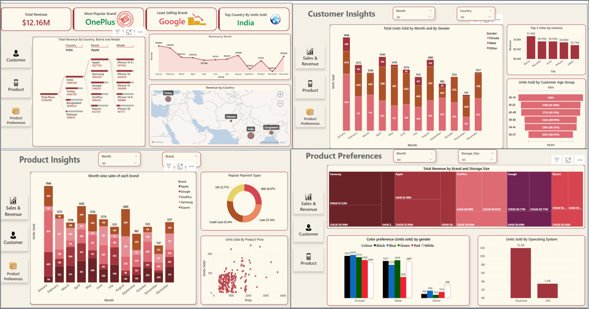

### Onyx-Data-Challenge-May-2025
<html>
<body> 

This is the dashboard that I built as part of the Onyx DataDNA Challenge.

Tools Used: Power BI, DAX and Data Modeling
 

Power BI features used: Decomposition Tree, Heatmaps, Map Visuals and KPI Cards among others

My dashboard is divided into 4 sections:
<ul>
 <li>Sales and Revenue</li>
<li>Customer Insights</li>
<li>Product Insights and</li> 
<li>Product Preferences</li>
</ul>

Key Highlights:
- Total Revenue: $12.16M. This is excluding the duplicate transactions IDs that were present in the dataset
- The maximum number of units were sold in India
- OnePlus is the top-selling brand whereas Google is the least selling brand in terms of units sold
- Samsung 128GB was the top selling brand in terms of revenue
- The month of January saw the most sales followed by April. Least sales were in the month of November
- The city with most units sold is Bursa followed by Mumbai and Izmir
- Age group 26-33 attributed to maximum sales
- Gender-wise, most units were purchased by the female customers
- In terms of color preferences, black and blue were most preferred by female customers and black and green were preferred by male customers
- Android OS was the top selling OS in terms of units sold 
 
Snapshot of the entire dashboard is as below :

</img>

</body>
</html>

